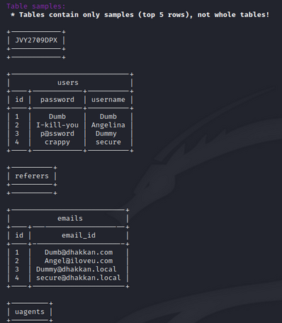

# MASAPT 🤖 ↔ &#129302; ↔ 🤖
___

&nbsp;

_❗_ <span style="color:red">_Warning_</span>


> This tool is developed for academic and research purposes as a part of the
  _Multiagent systems_ course at _Faculty of organization and informatics_.
  This tool is not to be used without consent of a second party whose security
  is being tested.
>
> Author holds no responsibility for any damage made with this tool and
  condemns any nefarious usage of the same.

___

## Welcome to...

_Multi-Agent System for Automated Penetration Testing_ 🐱‍💻


&nbsp;

### Explore → Exploit → Report → 📝

An autonomous system of _[SPADE](https://spade-mas.readthedocs.io/en/latest/index.html)_ agents communication over XMPP to coordinate and perform
penetration testing. In a CLI tool!

Pass the URL, wait a bit, read the report!

&nbsp;
&nbsp;

 

___

## What is MASAPT?

It's a _proof-of-concept_, multi-agent system, developed in Python, intented to be used
for automating the process of penetration testing in a structured and inteligent way.

**The ultimate goal** is to make a working, flexible, distributed, CLI based - pentesting
tool that can be used for automating penetration testing tasks.

Currently implemented features:

- Performing network scanning with __Nmap__
- Performing basic SQL injection with __SQLMap__
- Generating report with the results of performed exploits and reconnaissance

Future plans and features are listed [here](#Further-work).
___

### How to run?

_Difficult_.

#### **Install requirements:**

There's a fair number of prerequisites and requirements to install:

- Kali Linux 2020.4 (_optional_) - any Debian based OS should work fine.
- Python 3.8
- Pip3
- SPADE
- SQLMap (Already installed on Kali)
- Nmap (Already installed on Kali)

Beside Python and pentesting tools that can be found on Kali, you also need
access to some XMPP service. For testing the system I used **ejabberd**
running locally.

To run the agents on your XMPP server of choice, you will need to create
the following users. You can of course create other users, but then you
will need to pass the new JID and PWD parameters when creating agents in
_masapt_ script.

| JID | PASSWORD |
| :--:| :------: |
| _repoter@domain_ | repoterSecret |
| _explorer@domain_ | explorerSecret |
| _coordinator@domain_ | coordinatorSecret |
| _sqlinjector@domain_ | injectorSecret |

#### **Setup:**

After the prerequisites have been installed and XMPP has been set up:

1. cd into the project folder

    ```bash
        cd ../MASAPT
    ```

2. Add directory to PATH

    ```bash
        export PATH=$PATH:/path/to/MASAPT
        source ~/.bashrc
    ```

3. Install python requirements

    ```bash
        pip install -r requirements.txt
    ```

4. Make _masapt_ script executable

    ```bash
        chmod +x masapt
    ```

#### **Run:**

Start the system with:

```bash
    masapt -t url/to/target
```

&nbsp;

___

### Further work

- [ ] install.sh script
- [ ] Docker agents
- [ ] Connect with exploit database/knowledge base

**More agents:**

- [ ] DoS agent
- [ ] XSS agent
- [ ] Buffer overflow agent

**Expand _Explorer.py_ so it can:**

- [ ] Run Harvester
- [ ] Run more OSINT tools

**Expand _SQLinjector.py_ so it can:**

- [ ] Make better use of SQLMap
- [ ] Be adaptable to more types of databases

**Expand _Coordinator.py_ so it can:**

- [ ] Make better decisions about which agents perform attacks

___

## System overview 🔎

MASAPT system was envisioned to be **_modular_**, **_distributed_** and **_pragmatic_**. Meaning that agents
that make up the system are independent of the main process, upgradeable and use existing, 'battle-tested'
pentesting tools.

To achieve the goals envisioned, agents are developed as part of a **_three-tier model_** which is derived from
standard steps of conducting a pentest (planning - execution - post execution). A very high overview of the said model can be seen on an image below.

In the first image, arrows represent the flow of data in the model. 

First tier contains the **Explorer** agent(s) which are tasked with conducting OSINT and gathering any useful intelligence about the target.

Second tier contains the **Coordinator** agent and **_Exploit_** agents. The Coordinator is a single agent
that decides which exploit agents are going to take part in the current testing. Exploit agents, as the name
implies, are the ones running exploits - SQL injection, XSS, DoS, buffer overflow... There can be many of
these exploit agents.

Third tier contains the **Reporter** whose task is to collect all exploit data, results, data dumps from
all exploit agents and summarise it in a final report. The report is then showed to the user and stored
locally.

&nbsp;

 

&nbsp;
&nbsp;

 


Second image shows the same model as the first image but in greater detail. Agents can be
clearly found in their respective tiers.

### Agent behaviour

Aside its ability to communicate, behaviour is the second most important aspect of any agent.
MASAPT agents and their behaviour is modelled with a set of states, what makes them: __finite state automata__ or __finite state machines__. SPADE environment has good support for creating finite
state machines.

Diagrams below show all possible states an agent can be in at any moment.
in time. Diagrams also show what events cause agent to switch to the next state.
ALL FUTURE AGENTS should be implemented in the same manner.

All future exploit agents (ex. DoS, XSS...) should be implemented using the Img 8. diagram as template

&nbsp;

 

&nbsp;

 

&nbsp;


## References 🔗

[1] Big thanks to **_Audi-1_** and his excellent [SQLI labs](https://github.com/Audi-1/sqli-labs)
for testing error based, blind boolean and time based SQL injection!

[2] [Chu, Ge, and Alexei Lisitsa. "Agent-based (BDI) modeling for automation of penetration testing." arXiv preprint arXiv:1908.06970 (2019).](https://arxiv.org/abs/1908.06970)

[3] [Qiu, X., Wang, S., Jia, Q., Xia, C., & Xia, Q. (2014, October). An automated method of penetration testing. In 2014 IEEE Computers, Communications and IT Applications Conference (pp. 211-216). IEEE.](https://ieeexplore.ieee.org/abstract/document/7017198)
